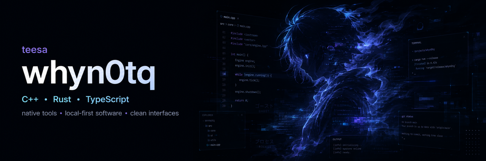

<p align="center">
  
</p>

<p align="center">
  <a href="https://github.com/whyn0tq?tab=repositories">
    
  </a>
  <a href="https://t.me/why_notq">
    
  </a>
</p>

<p align="center">
  <code>native tools</code>&nbsp;&nbsp;•&nbsp;&nbsp;<code>local-first software</code>&nbsp;&nbsp;•&nbsp;&nbsp;<code>clean interfaces</code>
</p>

<br />

## `> whoami`

```yaml
alias: teesa
handle: whyn0tq
location: Germany

building:
  - native desktop applications
  - developer and security tools
  - local-first interfaces

principles:
  - clarity over noise
  - privacy by default
  - small, reliable releases
```

## `> featured_projects`

<table>
<tr>
<td width="50%" valign="top">

### [Nexa](https://github.com/whyn0tq/Nexa)

A modern, local-first **SSH and SFTP workspace for Windows**, built around fast navigation and a clean native interface.

<p>
  
  
  
  
</p>

`native UI` · `async transfers` · `local-first`

[open repository →](https://github.com/whyn0tq/Nexa)

</td>
<td width="50%" valign="top">

### [GenPass](https://github.com/whyn0tq/genpass)

A compact **password generator and strength checker** written in Rust, focused on predictable CLI workflows.

<p>
  
  
  
  
</p>

`fast` · `small` · `cross-platform`

[open repository →](https://github.com/whyn0tq/genpass)

</td>
</tr>
</table>

## `> stack`

<p align="center">
  
</p>

## `> current_process`

```text
[01] Nexa      :: refine the native SSH/SFTP experience
[02] GenPass   :: improve tests, releases and CLI ergonomics
[03] Next      :: build useful software without unnecessary noise
```

## `> signal`

```text
status    : building
interests : native software / tooling / security / interface design
contact   : t.me/why_notq
```

<br />

<p align="center">
  <sub>quiet software · sharp tools · clean interfaces</sub>
</p>
